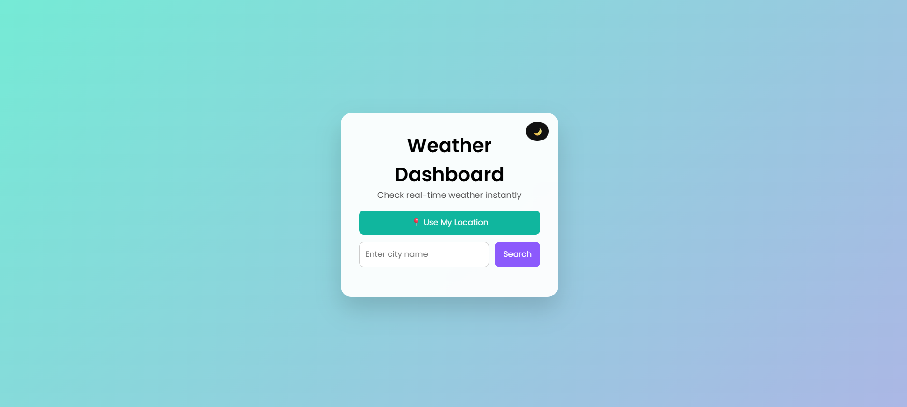
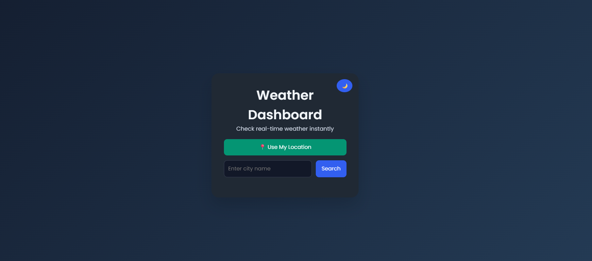
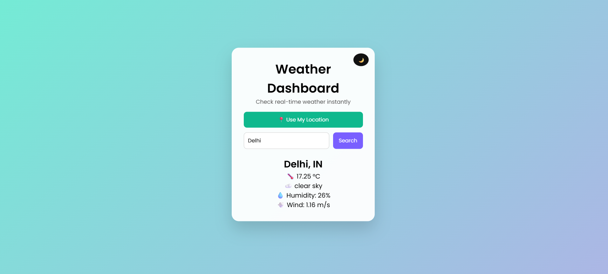

# 🌦️ Weather Dashboard


A modern and interactive **Weather Dashboard web application** that provides **real-time weather information** for any city and the user’s current location using a public weather API.

🚀 Built with clean UI, dark mode support, and smooth user interactions.

---

## 🔗 Live Demo

[](https://weather-dashboard-cgewig32o-varun2146s-projects.vercel.app/)


---

## 📸 Screenshots

### ☀️ Light Mode


### 🌙 Dark Mode


### 📍 Location-Based Weather



---

## ✨ Features

- 🔍 Search weather by **city name**
- 📍 **Auto-detect user location** using the browser’s Geolocation API
- 🌡️ Displays:
  - Temperature
  - Weather condition
  - Humidity
  - Wind speed
- 🌙 **Dark Mode toggle** for better accessibility
- 🎨 Modern UI with smooth animations
- ⚠️ Error handling for invalid input and API failures
- 📱 Responsive design for all devices

---

## 🛠️ Tech Stack

- **HTML5** – Structure  
- **CSS3** – Styling, animations, dark mode  
- **JavaScript (ES6)** – Logic, API handling  
- **OpenWeather API** – Real-time weather data  

---


---

## ⚙️ Setup & Usage

1. Clone the repository
   ```bash
   git clone https://github.com/your-username/weather-dashboard.git


**📚 What I Learned**

Integrating third-party APIs

Handling asynchronous JavaScript with fetch and async/await

DOM manipulation and event handling

Implementing dark mode UI

Using browser APIs like Geolocation

Improving user experience with animations and transitions

**🚀 Future Improvements**

🌦️ Weather icons based on conditions

🌡️ 5-day weather forecast

🌍 Multiple language support

💾 Save last searched city using localStorage

**🤝 Contributing**

Contributions are welcome!
Feel free to fork the repository and submit a pull request.


**⭐ Show Some Love**

If you like this project:

⭐ Star this repository

🍴 Fork it

🔗 Share it

👤 Author

Varun
Web Development Intern | Frontend Developer

## 📂 Project Structure


weather-dashboard/
├── index.html
├── style.css
├── script.js
└── screenshots/
├── light-mode.png
├── dark-mode.png
└── location-weather.png

